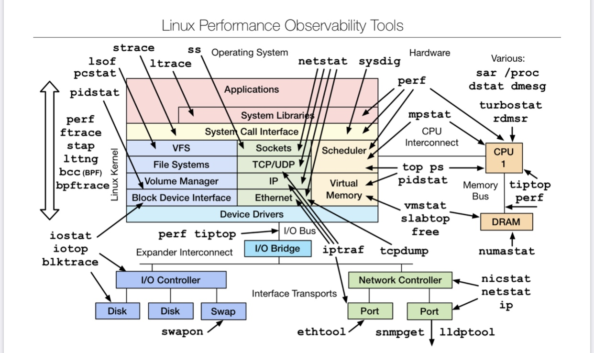

# PYTHON TASK 



A python script which wraps a command ( say example : "ping" ) in our case and does the following things -

1) -c           : This should tell us the number of times a command should be run
2) -fc          : This argument should tell us that how many times a command should be run before giving up
3) -m=debug     : This mode runs the command in "debug" mode
4) -m=help      : This should show us the manual
5) -strace      : Strace is used for Disk and Memory tracing
6) -pingparsing : It shows the system calls and transmitted packets in json format
7) -netstat     : Displays network connections for TCP, routing tables, number of network interface and network protocol statistics
### RUNNING THE SCRIPT

1) Clone the git repository
```
a) For http : git clone https://github.com/tsisodia10/runner.git

b) For SSH  : git clone git@github.com:tsisodia10/runner.git
```

2) Install the requirment.txt for all dependencies
```
 pip install -r requirements.txt
```

3) Run with
```
 pyhthon3 runner.py -c 2 -fc 2
```

4) If you want to use the debug mode 
```
 python3 runner.py -c 2 -fc 1 -m=debug
```

### CHALLENGES

1) os.system() vs subprocess.run()
2) Understanding netstat
3) Test cases

### REFERENCES 

1) https://docs.python.org/3/library/argparse.html
2) https://docs.python.org/3/library/subprocess.html
3) https://www.geeksforgeeks.org/python-os-system-method/
4) https://docs.python.org/3/library/os.html